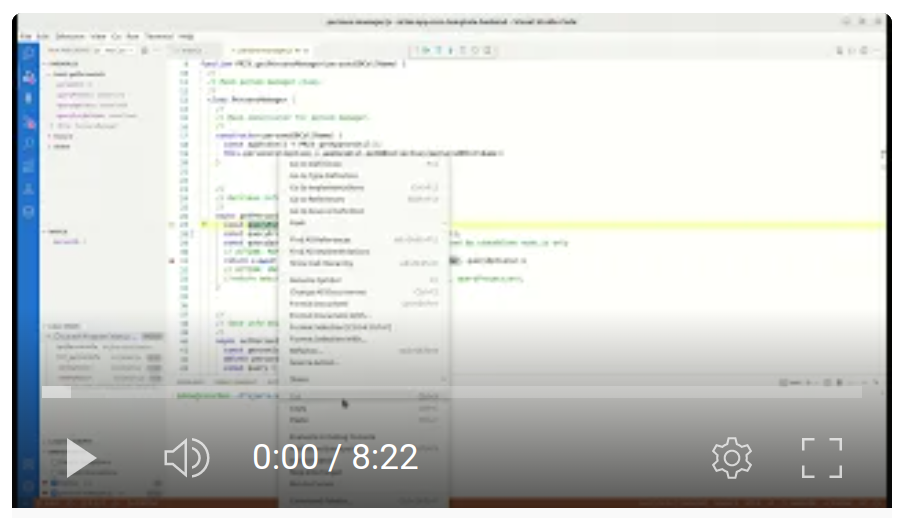
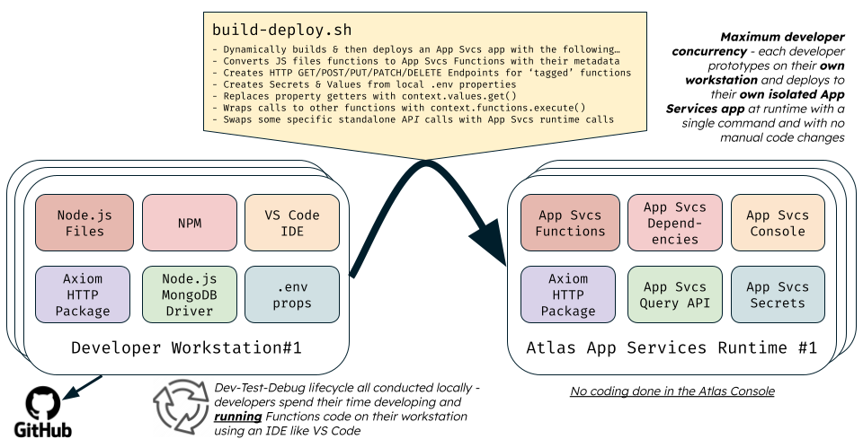

# Atlas App Services - Template Back-end Application Project

This project aims to show you how you can prototype and debug a 'back-end' [Atlas App Services](https://www.mongodb.com/docs/atlas/app-services/) application without having to develop code using the App Services Console. Additionally, you don't have to rebuild and re-deploy the application to the App Services runtime each time you need to test a change you've made. Instead, you can use your favourite local workstation tools, such as [Node.js](https://nodejs.org/), and [VS Code](https://code.visualstudio.com/) for the development and testing of code. The following video shows how easy it is to develop a back-end application locally:

[](https://youtu.be/ScIa20X61iA)

This approach doesn't just shield developers from each other when developing and testing the application's code on their workstations. It also means that each developer's deployed App Services runtime application is independent of any version of the runtime application deployed by another developer. Even when there are multiple developers, they don't clash with each other when they are all concurrently working on the same project codebase.

This project only supports building 'back-end' services like HTTP Endpoints, Triggers and Remote Functions. To include a 'front-end' web app in the same App Services app, refer to the sibling Github project [atlas-app-svcs-template-app](https://github.com/pkdone/atlas-app-svcs-template-app) instead.


## Project Content

You can use this 'skeleton' project as the basis of a new [Atlas App Services](https://www.mongodb.com/docs/atlas/app-services/apps/create/) project. The project has the following features:

- An [App Services](https://www.mongodb.com/docs/atlas/app-services/) app containing Functions, Triggers and HTTPS Endpoints, where you prototype, debug and test the code locally on your workstation.
- A simple Bash script (`build-deploy.sh`) that automates the deployment of the full-stack application to the App Services runtime when you issue the single deploy command.
- The sensitive properties that the project's `.env` file contains, which you use when running the project's code on your workstation, are automatically transferred to [Values and Secrets](https://www.mongodb.com/docs/atlas/app-services/values-and-secrets/) in the App Services runtime deployment.

The project contains some minimal example components to provide a basic working app. However, it is simple for you to rapidly remove or refactor the example parts and use the remaining skeleton project structure as the basis of your own Atlas App Services app. The example components in the project are composed of:

- A sample [Atlas](https://www.mongodb.com/atlas) [MongoDB](https://www.mongodb.com/docs/manual/) database with a `persons` collection. 
- One public function for clients to obtain the App Service deployment's runtime host IP address.
- Two HTTPS Endpoints, one for persisting data about a person and one for returning this info.
- One scheduled trigger to periodically log the runtime host's IP address.
- One database trigger to log a summary of changes made for each modified 'person' database record.


## Prerequisites

1. Ensure you have the following software installed on your workstation:

    - [Node.js JavaScript runtime](https://nodejs.dev/en/download/package-manager/)
    - [`npm` package manager CLI](https://docs.npmjs.com/downloading-and-installing-node-js-and-npm)
    - [MongoDB App Services `realm-cli` CLI](https://www.mongodb.com/docs/atlas/app-services/cli/)
     * [`curl` web CLI](https://curl.se/)

2. Ensure you have a running [Atlas](https://www.mongodb.com/atlas) MongoDB dedicated (not serverless) cluster of any size/tier (you can even use an 'M0' free-tier version). Using the Atlas console, ensure the cluster has a database user possessing just the **`readWrite` specific privileges for the `mytestdb` database** and ensure the Atlas Project's network access includes an **access list entry to allow access from your workstation's public IP address**.

3. For your Atlas project, which contains the Atlas database cluster to be used by the app, using the Atlas console, **create a Project API Key** for the project with just the `Project Owner` role enabled (be sure to save a copy of the generated private key as the console will only show this once). Ensure the **access list** for this Project API Key has your **current workstation's public IP address** listed.

4. From the Atlas console, navigate to your project, open `Project Settings`, and note its `Project ID`.

5. In a terminal on your workstation, from the root folder of this project, run the following command to copy an example environment configuration file to a new file into the same root folder called `.env`, and then edit the values for the properties shown in this new `.env` file to reflect your specific environment settings:

    ```console
    cp 'EXAMPLE.env' '.env'
    ```


## Deploy / Redeploy To Atlas App Services Runtime

In a terminal on your workstation, from the root folder of this project, execute the following command, which will rebuild the app from its source files and deploy the app to Atlas using the Atlas App Service's command-line tool (`realm-cli`):

```console
./build-deploy.sh
```

Note, the deployment process makes use of code in the `src` folder to:

1. Create and populate a simple `persons` database collection (in `initialize-database.js`)
2. Convert all the 'standard' Node.js Javascript functions to App Services 'special' JavaScript functions and generate required Triggers and HTTPS Endpoints in the App Services runtime (in `convert-to-app-svcs-proj.js`).


## Testing Remotely

The 'back-end' app contains several elements you can test following app deployment.

To test the remote public function `PUB_getHostEnv` to obtain the App Service deployment's runtime host IP address, run the following from a terminal from the project's root folder:

```
source .env
realm-cli function run --app="${APP_NAME}" --name PUB_getHostEnv
```

The output results will show the host's IP address in the App Services runtime, which executes the remote function.

To test the two remote HTTPS Endponts (REST APIs) for getting a person's data from the database and then updating a person's data in the database, from the terminal, run the following (in both commands, replace 'XXXXX' with the relevant part of you 'AppId' which you can see from the App Services console):

```
curl https://eu-west-1.aws.data.mongodb-api.com/app/mytestapp-XXXXX/endpoint/personInfo?personId=1

curl \
-H "Content-Type: application/json" \
-d '{"personId": 1, "firstName": "Nancy", "lastName": "Nelson", "dateOfBirth": "2081-01-03T21:16:14.121Z"}' \
https://eu-west-1.aws.data.mongodb-api.com/app/mytestapp-XXXXX/endpoint/personInfo
```

The first command's output results will show the details for the matched person with the 'ID' of '1'. The second command will update this person's details and output the number of records changed (which should be one).

Use the App Services console to view the logs of the deployed scheduled trigger (`logHostEnv_scheduledTrigger`) and database trigger (`logDatabaseEvent_databaseTrigger`) to check they are working correctly.


## Prototyping And Debugging Locally On Your Workstation

After each change, you can rapidly develop and test the app's code locally without redeploying. The diagram below highlights how code execution is supported both on the local workstation and in the remote App Services runtime. It also describes the role of the `build-deploy.sh` script in converting from one to another:



The project code makes extensive use of 'modern' JavaScript (i.e. leveraging up to [ECMAScript 2021 / ES12 standards](https://en.wikipedia.org/wiki/ECMAScript_version_history)).

The project optionally supports developing and running in [Development Containers](https://containers.dev/) in [VS Code](https://code.visualstudio.com/docs/devcontainers/containers) or in [GitHub Codespaces](https://docs.github.com/en/codespaces/overview).


### Code Development

Using Node.js installed on your workstation or your IDE (e.g. _VS Code_), you locally code, refactor and debug the JavaScript functions belonging to the source files in the `src` folder. The top of the `src/main.js` source file contains sample code to run the functions that you will subsequently deploy as an Atlas App Services app. To test one of the functions locally, uncomment the appropriate line which invokes the function you want to test and then execute the Node.js file from your IDE or command line. 

Example Node.js command line to execute:

```console
node src/main.js
```

When you execute one of these functions locally, in addition to logging the results to the console, it writes its result to the file `tmp/results.json`. This file output is helpful when a function returns a large response payload. 

When executing locally from the workstation, the database persistence part of the code uses the [MongoDB Node.js Driver](https://www.mongodb.com/docs/drivers/node/current/) to interact with the Atlas database. When deployed to the App Services runtime, the code uses [App Serivces's built-in data source client](https://www.mongodb.com/docs/atlas/app-services/functions/mongodb/) instead. However, in many cases, the boilerplate code required for CRUD operations in each environment is identical. Where this isn't the case, the provided logic determines which flavour of persistence code to execute (see the next section of this README for more details).

The project's code uses the same [Axios NPM package](https://www.npmjs.com/package/axios) library for invoking remote HTTP services when running locally on a workstation and remotely in the App Services runtime.


#### Code Structure Conventions To Enable Conversion To App Services App

The `build-deploy.sh` script uses the utility code at `src/convert-to-app-svcs-proj.js` to convert JavaScript functions from `.js` files into App Services Functions definitions. It also generates the application configuration structure required for App Services deployment.

This process first incorporates the app services-related contents from the `template` folder. Therefore, to include other App Services resources in the final deployed project, you can add these to the `template` folder by following the [App Configuration](https://www.mongodb.com/docs/atlas/app-services/reference/config/) rules. 

You can create as many JavaScript `.js` files as you desire inside the `src` folder. The code conversion process uses the following rules to pick up appropriate functions defined in your various `.js` files and convert each to an App Services Function:

- Functions with names prefixed with **`PRIV_`** are included with their permissions set to **private**.
- Functions with names prefixed with **`PUB_`** are included with their permissions set to **public** so they can be invoked remotely.
- Functions with names prefixed with **`GET_`**, **`POST_`**, **`PUT_`**, **`DELETE_`**, **`PATCH_`** are included with their permissions set to **private**. A corresponding HTTP Endpoint is also generated for each function with its HTTP Method set to the respective REST API Verb implied by the function's name prefix.
- For all the functions that match the above prefixes, the function's Authentication property is set to **System** unless the function name has the suffix **`_AA`** (e.g. `GET_personInfo_AA`), which indicates that it requires **Application Authentication**. If this is the case, ensure you have defined appropriate [Data Access Rules](https://www.mongodb.com/docs/atlas/app-services/rules/) for all database resources that the function's code will attempt to access. You can include these rules in the template [app configuration](https://www.mongodb.com/docs/atlas/app-services/reference/config/) hanging off the folder `template/data_sources/mongodb-atlas`.
- The conversion process ignores functions that do not match the above prefixes and does not include these in the final App Services deployed app.

Within your JavaScript code, you can add one of the following new lines above an existing line in the source code if you want the existing line to be commented-out, uncommented, or removed, respectively, during the code conversion process:

```javascript
    // ACTION: COMMENT

    // ACTION: UNCOMMENT

    // ACTION: REMOVE
```


This capability is helpful if you know you have some code that will either work locally in Node.js or remotely in the App Services runtime, but not both. Alternatively, you can use the `AppSvsUtil.isRunningInAppSvcs()` function (from `src/app-svcs-util.js`) to dictate a specific code path to execute at runtime.

The code conversion process substitutes every place in the code that uses `context_values_get()` with the [App Services library function](https://www.mongodb.com/docs/atlas/app-services/functions/context/#reference-a-value--context.values-) `context.values.get()` instead to enable the app to obtain values from configured Secrets when running in an App Services deployment.

The code conversion process wraps calls from one function to another inside the `context.functions.execute()` [utility](https://www.mongodb.com/docs/atlas/app-services/functions/context/#call-a-function--context.functions-) to enable function invocation to work correctly when running in App Services.

The conversion process replaces some tokens with deployment environment values, which occur in various App Services JSON config files, including the App Name, Deployment Region/Location, Database Cluster Name and Database Name.

Unrelated to the conversion process, a key convention used in the code is adopting [JavaScript classes](https://developer.mozilla.org/en-US/docs/Web/JavaScript/Reference/Classes). This approach enables you to group related functions/methods without requiring them to be subsequently unpacked into separate App Services Functions during deployment (e.g. `class PersonsManager`). To allow access to class instances, a 'wrapper' function is required (e.g. `function PRIV_getPersonsManager()`). For an example of this in action, see `src/persons-manager.js`.  

The code uses the convention of sharing constant values via an accessor function to enable the system to share constants between different App Services Functions. For example, see `function PRIV_getConstants()` in `src/constants.js`. Each time you want to reference a constant from another App Services Function, you employ code similar to the following: `const myXyz = PRIV_getConstants().XYZ; `.


#### Restrictions / Caveats

Due to code limitations in the conversion process, there are restrictions in how you construct your back-end code. These include:

- The definition you specify for the signature of a function you want to convert must be wholly declared in a single line of code and not over multiple lines. The single-line must use a JavaScript 'Function Declaration', including the `function` keyword. The line must encompass the function's name, the optional `async` prefix if required, and the function's parameters contained in brackets. You cannot use a JavaScript 'Function Expression' or an 'Arrow Function' to define these 'convertible' functions. However, you can optionally use those other types of function definitions inside the code you use to implement these 'convertible' functions.
- For any given line of code, you must only invoke at most one `PRIV_` prefixed function in that line of code. If you attempt to invoke two `PRIV_` prefixed functions from the same line of code, the generated App Services Function will contain syntax errors and result in a deployment error.
